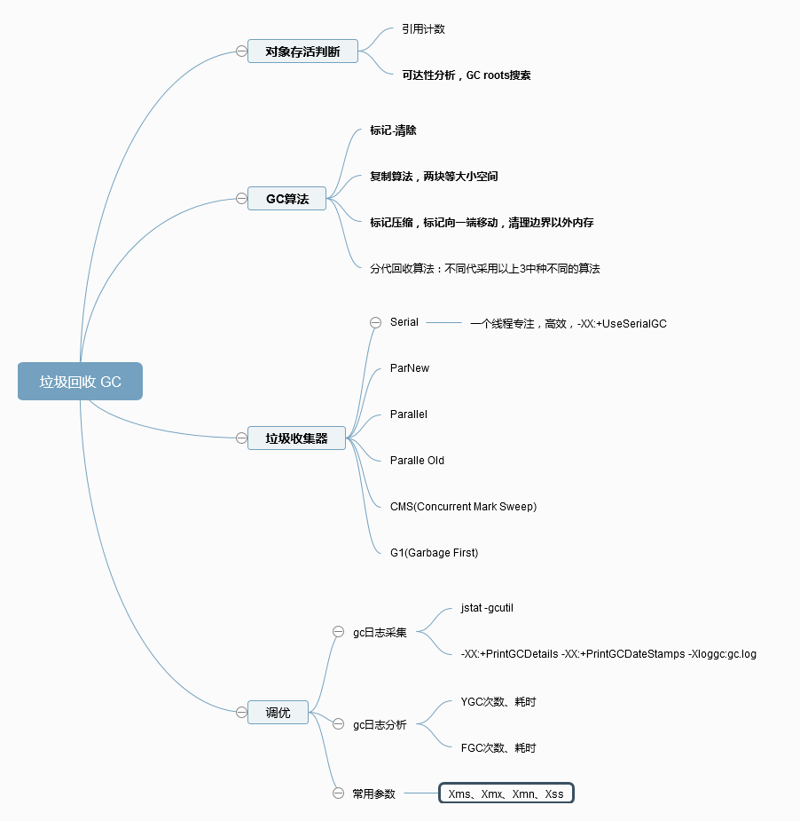

# jvm GC

## 1. 对象是否存活？
* 引用计数，循环依赖的问题
* 可达性分析，reachability，通过一系列的“GC Roots”对象作为起点来分析

## 2. 收集算法
* 标记清除，Mark-Sweep ，标记要回收的对象，统一回收标记了对象。 问题：两阶段效率不高、内存碎片
* 复制算法，分等大小两块，使用其中一块，回收时复制存活对象至另一块，让后将用过的空间一次性清理
* 标记-整理，Mark-Compact，让所有存活的对象都向一端移动，然后直接清理掉边界以外的内存
* 分代回收，无新思想，根据各个年代的特点采用适当的收集算法

## 3. 垃圾收集器
* Serial: 单线程收集器，简单高效，适用于Client模式下
* ParNew: Serial的多线程版本
* Parallel Scavenge: 使用的复制算法，关注控制吞吐量，通过限定垃圾回收最大时间-XX:MaxGCPauseMillis
* Serial Old: Serial收集器老年代的版本
* Parallel Old: Parallel Scavenge收集器的老年代版本
* CMS: Concurrent Mark Sweep以最短停顿时间为目标的收集器
* G1: Garbage First

## 4. GC: stop the world 问题
枚举根节点需要停顿，分析工作必须在某个时间点上，不然分析结果的正确性无法得到保证。虚拟机并不需要遍历所有的对象来得到引用位置，虚拟机应当是有办法直接知道哪些地方存放着对象引用。HotSpot是使用一组OopMap的数据结构，结合SafePoint、SafeRegion来实现的。

## 优化
#### GC 日志收集
```
$ jstat -gcutil

# vm arg
-XX:+PrintGCDetails -XX:+PrintGCDateStamps -Xloggc:gc.log
```

#### 观察 YGC、FGC 次数与耗时

#### 案例
* 高性能硬件 大内存Heap ，偶先长时间卡顿，Old 存储了大对象，Full GC耗时长

