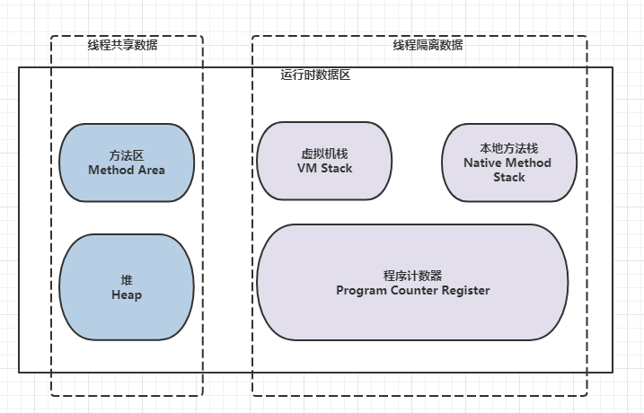

# jvm memory model
* Method Area： 方法区，存储了类信息、常量、静态变量等数据。

* Heap：对象存储

* VM Stack： 线程运行时需要，线程执行方法，多个方法形成链，栈帧中存储一些基本数据、对象引用， jvm 参数 Xss 设置单个线程栈的大小。

* Native Stack：类似VM Stack，只不过此处是本地方法。

* Program Counter Register： 程序计数器，线程执行指令，用来记录字节码地址。

### Heap 堆内存
#### Young Generation （1/3）:
* Eden (8/10)
* Survivor : from、to(2/10)

#### Old Generation （2/3）

Heap常用jvm参数：Xms、Xmx、Xmn，记忆口诀: 傻叉你 (sxn），初始、最大、Young
