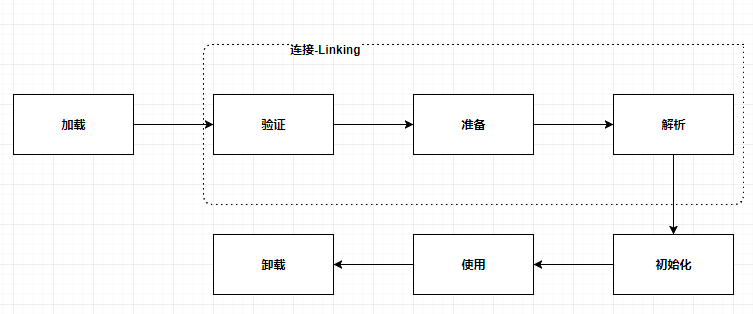
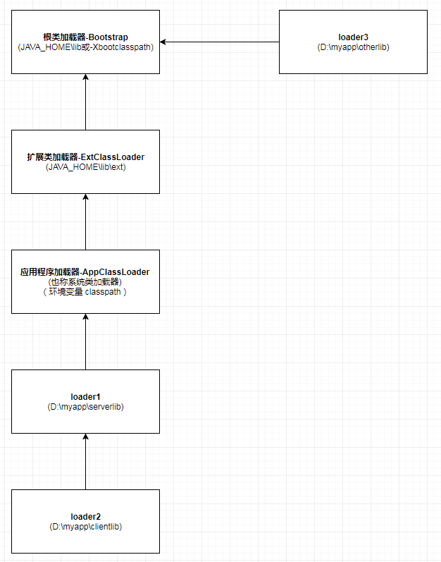

# jvm 类加载

#### 加载过程

* 加载： 字节码内容加载到内存

* 验证： 魔术 0xCAFEBABE、JDK版本等

* 准备： 类静态变量初始值设置

* 解析：符号引号解析为直接饮用

* 初始化：静态变量设置初始值

* 使用：

* 卸载：自定义类加载器的类可以被GC卸载

#### 触发类初始化
主动使用类才会触发类的初始化，而主动使用的行为包括：new、访问静态变量、调用静态方法、反射、初始化它的子类、作为启动类

### 类加载器
* 系统自带
    * 根类加载器 Bootstrap ClassLoader - 加载JAVA_HOME\lib下的包，例如rt.jar `java.lang.String`
	* 扩展类加载器 Extension ClassLoader - 加载JAVA_HOME\lib\ext目录，或者java.ext.dirs目录
	* 应用类加载器 Application ClassLoader - ，
* 自定义实现 ，继承抽象类ClassLoader，覆盖其findClass方法，可以指定父加载器，默认是 Application ClassLoader.

#### 特点
* Parents Delegation model 双亲委托模型，如果一个类加载器收到了类的加载请求，它首先不会自己去尝试加载这个类，而是把这个请求委派给父加载器取完成，每一个层次的类夹杂器都是如此，加载请求最终都会送到顶层的启动类加载器，只有当父加载器无法完成这个加载请求时，子加载器才会自尝试自己去加载。

测试例子：[MyClassLoader.java](https://github.com/elegance/dev-demo/blob/master/java-demo/src/main/java/MyClassLoader.java)

